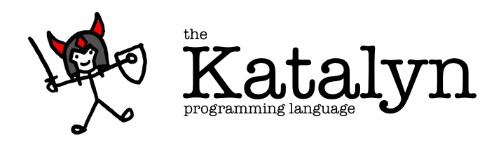

    
     
    
    

The **Katalyn** programming language is a powerful scripting language designed to pair _the simplicity of Lua with the power of Perl_.
It integrates an intuitive syntax with a comprehensive, batteries-included standard library of useful functions. Whether you are
writing console scripts, calling APIs or parsing text, Katalyn helps you get things done without getting in the way!

> [!NOTE]  
> I'm literally working on this README right now (July 26 2026), come back later!

> [!CAUTION]  
> Katalyn is not production ready in any way, form or universe.