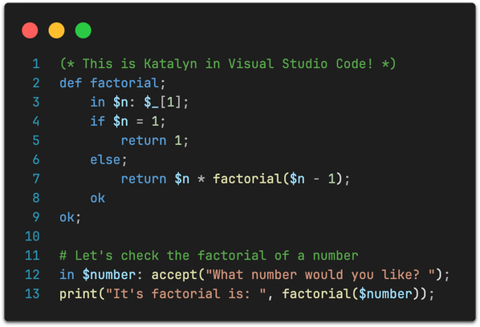
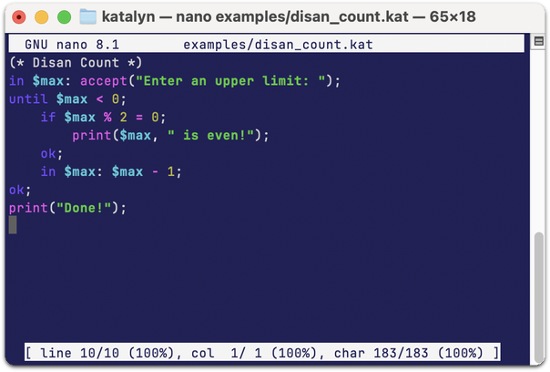

    
      
    
    

The **Katalyn** programming language is a powerful scripting language designed to pair _the simplicity of Lua with the power of Perl_.
It integrates an intuitive syntax with a comprehensive, batteries-included standard library of useful functions _[(under development)](#contributing-to-katalyn)_. Whether you are
writing console scripts, calling APIs or parsing text, Katalyn helps you get things done without getting in the way!

    

The Katalyn interpreter (both the front-end and the virtual machine) are written in Python (at least for the time being).
Speed, particularly in number-crunching, is not the main focus of this project. Instead, our priorities are to provide
a comprehensive, batteries-included experience and to ensure Katalyn is intuitive and easy to learn. Our goal is to
help you write scripts quickly and enjoy the process.

## ⚔️ Building and Installing Katalyn

## 🛡️ Learning Katalyn (the docs)

While the standard library includes many functions for different uses, the language is actually very minimal and easy to use.

TODO

## 🧙🏻‍♂️ IDE Support

We've developed Katalyn code highlight extensions for the most popular IDEs out there. There's one for [Visual Studio Code](https://marketplace.visualstudio.com/items?itemName=Lartu.katalyn-syntax-highlight) available in the Visual Studio Marketplace.
Alternatively, you'll find highlight extensions for Nano and Vim in the [Highlight](/highlight) directory of this repository.

 

## 🔥 Contributing to Katalyn

Contributions both to the language and the standard library are welcome. There are a lot of things to be done on the interpreter side.
Performance optimizations, bugfixes, code cleanup, ports to more efficient languages, all are welcome. Alternatively, if you've
learned yourself some Katalyn (for the greater good), you can also contribute code to the standard library or write examples and
documentation. Other ways of contributing are writing IDE extensions or any other utilities that improve the Katalyn ecosystem.
Be creative! We are new here, every bit helps! Even telling your programmer friends about Katalyn is very useful!

Contributors are expected to behave by the Katalyn [Code of Conduct](.). Basically, please be nice to everyone.

## 🏰 Getting Help

If you have any questions regarding Katalyn, you are welcome to [submit an issue](https://github.com/Lartu/katalyn/issues) to this repository, check the [Katalyn Website](.) or contact us via any other medium. There are no dumb questions, just ask away!

## 👑 License

Katalyn is distributed under the [Apache 2.0 License](LICENSE). Katalyn (both the language and the [character](https://eterspire.com)) and related media were created by Lartu. The Katalyn logo is released under a Creative Commons Attribution 4.0 International (CC BY 4.0) license.

